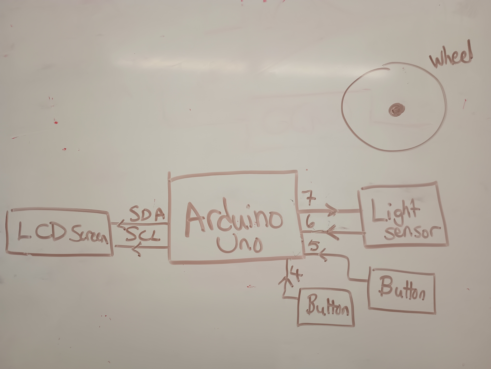
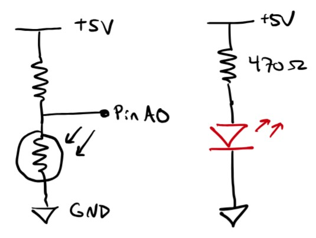
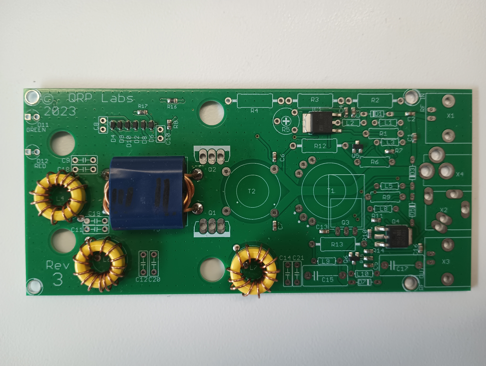

# Project Name Here
Team Member(s):

- Write up a paragraph or two that describes your final hack's objective, and all its sensors and actuators.

# Schematics and Block Diagrams

- Draw a block diagram showing how different components are connected together.

This is an example block diagram.

- Draw an electrical schematic for any soldered or breadboarded circuits.

This is a component-level schematic of a light sensor.

# Materials

| Item         | Source (URL) |
| ------------ | ------------ |
| 6V Servo motor  | https://www.digikey.com/en/products/detail/pololu-corporation/3425/10450114 |
| et cetera | and so on and so on |

# Narrative

- Describe the process of building your final hack project.
- Did the design change as you worked on it?
- Include any problems you encountered, and how you addressed them. 
- This section should be at least ~500 words. Be reflective!

# System Photos

- Include photos that describe your system in the img directory.
- Include a descriptive caption for each image.

This is a caption describing the image above!

# Code Description

- Attach your code in the code directory.
- Include comments in the code that explain important functions.
- Cite any sources you got help or code from.
